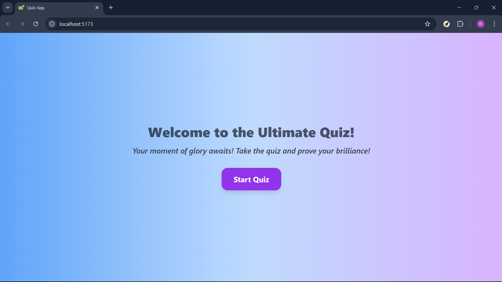
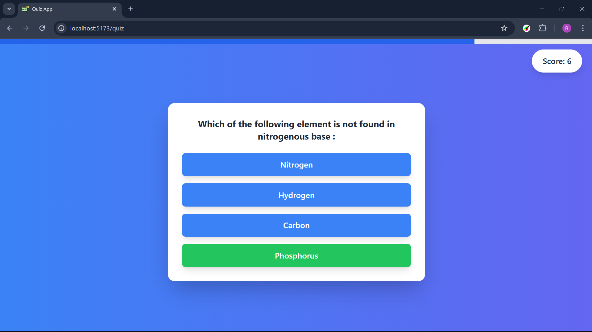
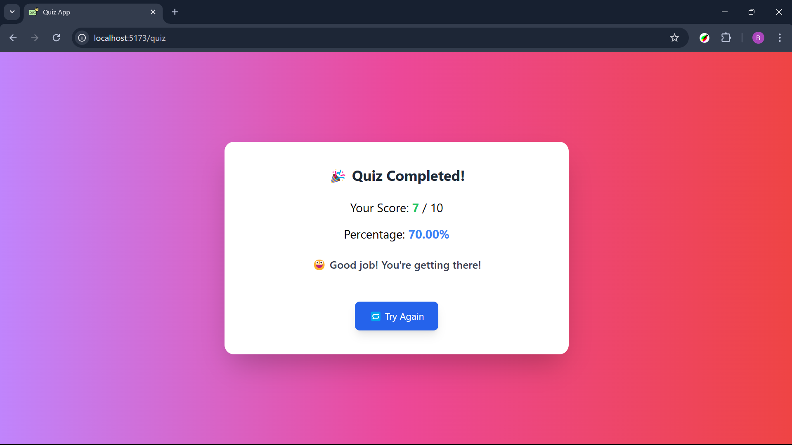

# **Quiz App 🎯**

A **fun and interactive** quiz application designed to test and enhance your knowledge through engaging multiple-choice questions. Built with **React.js** for a seamless user experience and styled using **Tailwind CSS** for a modern and responsive UI.

---

## **📌 Overview**  
The **Quiz App** provides an engaging platform where users can participate in quizzes, track their scores, and receive performance-based feedback. The intuitive interface ensures a smooth and enjoyable experience across all devices.  

This project follows a **component-based architecture** in React, making it modular, maintainable, and scalable. It also integrates an **Express.js backend API** to fetch dynamic quiz data, ensuring fresh and updated content for users.

### **Key Objectives:**  
✔️ Provide a dynamic and interactive quiz-taking experience  
✔️ Deliver real-time feedback and score tracking  
✔️ Ensure accessibility and responsiveness across devices  
✔️ Implement an efficient backend for question retrieval and storage  

---

## **🚀 Features**  
✅ **Multiple-choice questions** – Choose the right answer from various options  
✅ **Score tracking** – Keep a real-time record of your performance  
✅ **Performance-based feedback** – Get insights based on your score  
✅ **Dynamic question fetching** – Questions are retrieved via an API  
✅ **Fully responsive design** – Works on all screen sizes  
✅ **Smooth animations** – Enhancing user experience with modern UI elements  

---

## **📸 Screenshots**  
### **1️⃣ Quiz Start Page**  
  

### **2️⃣ Quiz Question Page**  
  

### **3️⃣ Quiz Result Page**  
  

---

## **🎥 Video Walkthrough**  
🎥 [Watch the Demo](https://drive.google.com/file/d/19WRfY30XhzyTinxZDA5ZWyeMYGahl_Ce/view?usp=drive_link)  

---

## **🛠️ Setup Instructions**  

### **1️⃣ Clone the Repository**  
```bash
git clone https://github.com/Rohiitkumaar/QuizApplication
```

### **2️⃣ Install Dependencies**  
Navigate to the frontend directory and install required packages:  
```bash
cd Frontend  
npm install
```

### **3️⃣ Start the Application**  
Run the development server:  
```bash
npm run dev
```
The app will be accessible at **http://localhost:5173**  

---

## **💬 API Endpoint**  
The quiz data is fetched from the backend API:  
**Base URL:** `https://quizapplication-xfud.onrender.com/api/quiz`

---

## **💍 Tech Stack**  
- **Frontend:** React.js, Tailwind CSS  
- **Backend:** Node.js, Express.js

---

## **📢 Upcoming Features**  
- Timed quizzes for added challenge ⏳  
- Leaderboard to track top scores 🏆  
- More question categories & difficulty levels 🔮  

---

## **📧 Feedback & Contributions**  
🔗 Feel free to **fork** this repository, **create issues**, or **submit pull requests** to enhance the project!  
📢 If you encounter any bugs or have feature suggestions, let me know!  

**Happy Coding! 🚀🎉**  
